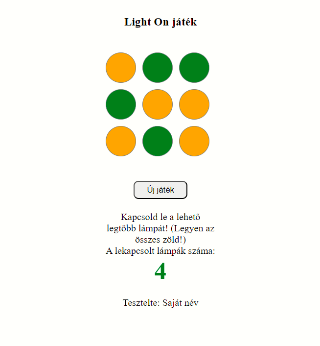
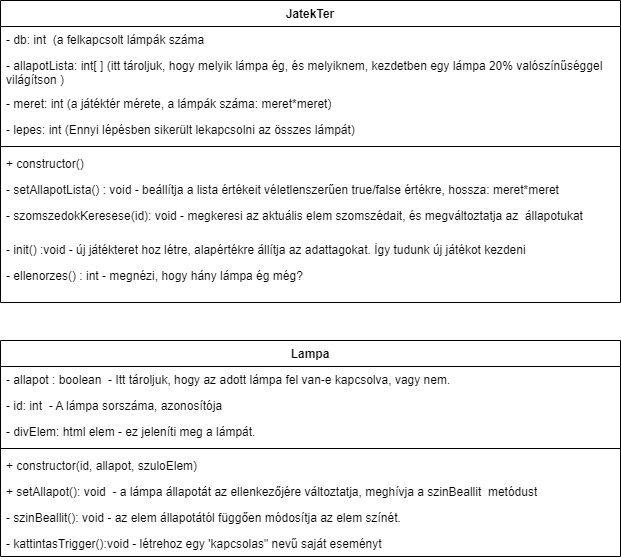

# LightOn játék megvalósítása OOP alapokon

## Fealdat a kiinduló fájlok alapján a játék tesztelése. 

## A feladat leírása: 

Adott egy nxn-es terület, aminek az egyes elemei lámpákat jelképeznek. Amikor rákattintok egy lámpára, akkor az a lámpa és a szomszédai állapota is megváltozik: ha le volt kapcsolva, akkor felkapcsolódik, ha fel volt kapcsolva, akkor le. Kezdetben egy lámpa 20% valószínűséggel van felkapcsolva, a többi lekapcsolt állapotú.

Készíts alkalmazást, amely megjeleníti a lámpák aktuális állapotát, illetve lehet vele "játszani". A cél az összes lámpa lekapcsolása. Amikor ez sikerült a felhasználónak, írja ki a program, hogy "Hurrá, meghosszabítottad a Föld életét!",

Illetve leygen egy "Új játék" gomb is, amivel be lehet fejezni, vagy újra lehet kezdeni a játékot. 

## Mit kell tudnia egyetlen elemnek? - egy elem az egy lámpa. A Lampa osztály az alábbiakat tudja:

Elhelyezkedik valahol a HTML DOMban (indenx.html-en) - az adattagjai az ezen elemeket jelölő szelektorokhoz rendelt változók.  
Ha rákattintunk történik vele valami (megváltozik a színe ) - kell egy on.("click") eseménykezelő a konstruktorban. 
A színe akkor is változhat, ha a szomszédjára kattintunk. De fontos elv az OOP logikánál, hogy egy adott objektum csak saját magáról tud mondani valamit, a szomszédokról nem. Tehát a játéktér (jelen esetben a főprogram) fogja megmondani az egyes elemek aktuális állapotát, aminek függvényében fel vagy lekapcsoljuk a lámpát - azaz változtatjuk a háttérszínét. Ezért kell egy állapot adattag is a Lampa osztálynak. 
A játéktérrel való kommunikációhoz kell egy saját esemény kezelő. Ez váltódik ki, ha rákattintunk az elemre. 
A játéktér kezeli a lámpákat, ő lát rá az összes lámpára, míg az egyes lámpák csak kis csoporttudattal nem rendelkező egoista lények, csak magukról tudnak, legfeljebb néha üzeneteket küldenek a külvilágnak és kapnak is onnan valami utasítást, pl. amikor meghívódik egy tagfüggvénye. 

## A JatekTer tehát a következőket tudja: 

Létrehoz annyi példányt, ahány lámpára szükség van. 
Figyeli, hogy az egyes lámpák esetében történt-e változás. Ezt oly módon teszi, hogy az 5. pontban leírt saját lámpaeseményre feliratkozik, elkapja. 
Ha kiváltódik az esemény, akkor megnézi, hoyg melyik lámpák állapotát kell még módosítani, és azok szetterét meghívja. 
Nézd meg az UML ábrát is! Az alapján dolgozz!

 

  
